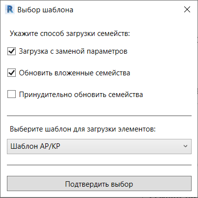
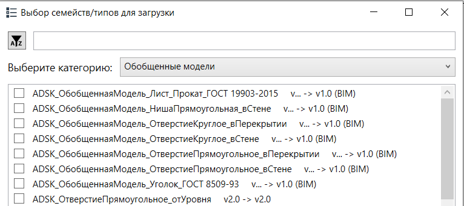

## Описание Функция загрузки выбранных семейств/типов системных элементов из шаблона.
```
Для работы нужен сформированный (отдельный) файл, который используется в качестве единого шаблона.
Данный способ обеспечивает единообразие проектов, а также позволяет удобно следить за версионностью семейств. 
  
Поэтому скрипт открывает подобный файл и сканирует все его семейства
```
---
Чтобы обновить нужные семейства/типы, вы можете: 
1) Выбрать в проекте нужные вам семейства или же их типы(достаточно одного) в диспетчере задач -> нажать на эту кнопку. Так можно обновить ЛЮБЫЕ семейства, главное, чтобы они были в шаблоне. Типы системных элементов таким образом обновить невозможно.  
                                    ИЛИ
2) Сразу нажать на кнопку. Тогда вам самим придется выбрать семейства/типы для загрузки. Если выбранного семейства нет в проекте — оно будет загружено, если уже есть, то семейство будет обновлено. Список типов системных элементов состоит только из типов, которых нет в проекте.

Когда вы нажмете на кнопку, на экране появятся пошаговые инструкции. Просто следуйте им.

---
### Способы загрузки - дублируют стандартное поведение revit при загрузе семейс

  
Загрузка с заменой параметров — заменит все параметры при загрузке семейства.  
Обновить вложенные семейства — при включении загрузит как основное семейство, так и его компоненты в проект.  
Принудительно обновить — если при загрузке семейства Revit не видит в нем изменений (но они могут быть), то загрузка будет произведена фиктивно (случай, когда не появляется окно выбора способа загрузки). Чтобы это исправить, создана данная функция.  

---
### Также поддерживается версионность семейств. В зависимости от версии метод загрузки будет отличаться
`Если подписано (BIM) — то обновление может производить только компетентный человек или тот, кому он доверит пароль`  


